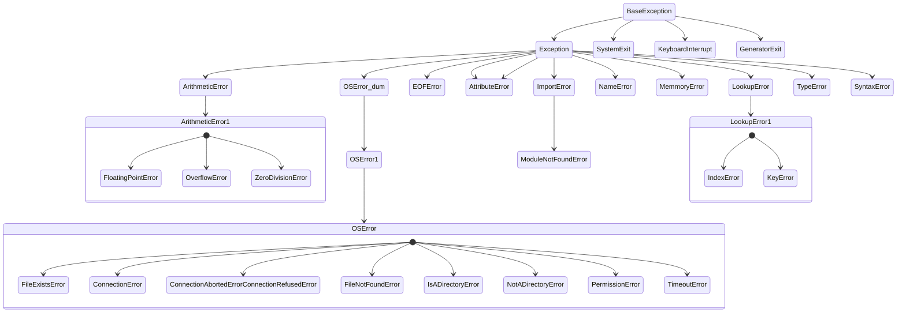

```mermaid
stateDiagram-v2
    BaseException --> Exception
    BaseException --> SystemExit
    BaseException --> KeyboardInterrupt
    BaseException --> GeneratorExit
    Exception --> ArithmeticError
    Exception --> ImportError
    Exception --> EOFError
    Exception --> AttributeError
    Exception --> LookupError
    Exception --> AttributeError
    Exception --> NameError
    Exception --> MemmoryError
    Exception --> OSError_dum
    Exception --> TypeError
    Exception --> SyntaxError
    ArithmeticError --> ArithmeticError1
    state ArithmeticError1 {
         [*]-->  FloatingPointError
         [*] --> OverflowError
         [*] --> ZeroDivisionError
    }
    OSError_dum --> OSError1
    OSError1 --> OSError 
    ImportError --> ModuleNotFoundError
    state OSError {
        [*] --> FileExistsError
        [*] --> ConnectionError
        [*] -->   ConnectionAbortedErrorConnectionRefusedError
        [*] --> FileNotFoundError
        [*] --> IsADirectoryError
        [*] --> NotADirectoryError
        [*] --> PermissionError
        [*] --> TimeoutError
    }
    LookupError  -->  LookupError1
    state LookupError1 {
        [*]  -->  IndexError
        [*]  -->  KeyError
    }

```
